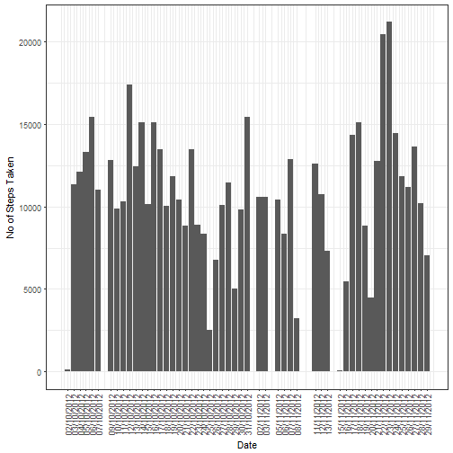
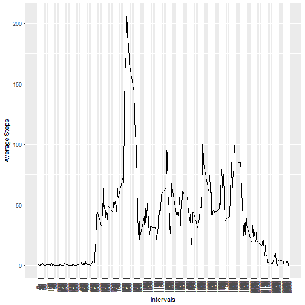
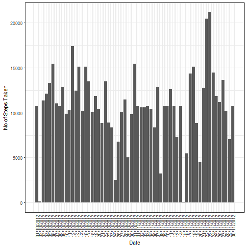
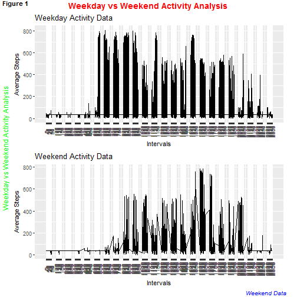

## R Markdown

This is an R Markdown document. This markdown document contains the code and descriptions for the assignment4 containing activity data.

##Step1 : Load data from the csv file


```r
     acdata   <- read.csv("activity.csv")
```
##Step2: Calculate the total number of steps taken per day
##       Plot a histogram of "dates" in (x axis) and "total number of steps taken per day" in (y axis)

```r
	   acsum    <- aggregate(steps~date, data=acdata, sum, na.rm=TRUE)
	   acsum$date <- as.Date(acsum$date)
## Including Plots
	   ggplot(acsum, aes(x = date, y = steps)) + 
	   geom_bar(stat = "identity") +
	   theme_bw() + labs(x = "Date", y = "No of Steps Taken") +
	   scale_x_date(breaks =acsum$date,labels = date_format("%d/%m/%Y")) +
	   theme(axis.text.x = element_text(angle=90, vjust = 0.5))
```


	   
##Step3: Calculate the total mean and median of the number of steps taken per day

```r
	   acdata1 <- na.omit(acdata[ acdata$steps != 0,])
	   myFun <- function(x) {c(mean = mean(x), median = median(x))}
	   newdata <- as.data.frame(cbind(date = unique(acdata1$date), do.call(rbind, tapply(acdata1$steps, acdata1$date, myFun))))
```
##Step4: Calculate the average number of steps taken in a 5-minute interval, averaged across all days for that interval
##       Make a time series plot (i.e. type = "l") of the 5-minute interval (x-axis) and the average number of steps taken, 
##       averaged across all days (y-axis)
    

```r
	   acaverage  <- as.data.frame(aggregate(steps~interval, data=acdata, mean, na.rm=TRUE))


	   ggplot(acaverage, aes(x=interval, y=steps)) + geom_line() +
	   scale_x_continuous(breaks =acaverage$interval)+ xlab("Intervals") + ylab("Average Steps")+
	   theme(axis.text.x = element_text(angle=90, vjust = 0.5))
```



##Step5: Calculate which 5-minute interval, on average across all the days in the dataset, contains the maximum number of steps

```r
	   maxvalue <- acaverage[which.max(acaverage$steps),]
	   maxvalue
```

```
##     interval    steps
## 104      835 206.1698
```
##Step6: Calculate  and print the total number of rows with missing (NA) values in the dataset

```r
	   na_count <- sum(is.na(acdata$steps))
	   na_count
```

```
## [1] 2304
```
##Step 7: Create a new dataset (acdatanew) and replace NA values with the Mean value of the "Number of Steps"

```r
	  acdatanew <- acdata
	  acdatanew$steps[which(is.na(acdatanew$steps))] <- mean(acdatanew$steps, na.rm=TRUE)
```

## Make a histogram of the total number of steps taken each day
## Plot a histogram of "dates" in (x axis) and "total number of steps taken per day"
## in (y axis)

```r
	  acsum1    <- aggregate(steps~date, data=acdatanew, sum, na.rm=TRUE)
	  acsum1$date <- as.Date(acsum1$date)


	  ggplot(acsum1, aes(x = date, y = steps)) + 
	  geom_bar(stat = "identity") +
	  theme_bw() + labs(x = "Date", y = "No of Steps Taken") +
	  scale_x_date(breaks =acsum1$date,labels = date_format("%d/%m/%Y")) +
 	  theme(axis.text.x = element_text(angle=90, vjust = 0.5))
```



##Step 8: Calculate the total mean and median of the number of steps taken per day on the 
##        data that has filled NA values created in Step &

```r
	  acdata1  <- na.omit(acdatanew[ acdatanew$steps != 0,])
	  myFunNew <- function(x) {c(mean = mean(x), median = median(x))}
	  newdata1 <- as.data.frame(cbind(Date = unique(acdata1$date), do.call(rbind, tapply(acdata1$steps, acdata1$date, myFunNew))))
```

## Step 9: Calculate and plot weekday vs weekend activity details using the following steps
##         Take the data where the NA values were replaced with the Mean value of the "Number of Steps"
##         Add a weekday column that contains the day of the week(Monday to Sunday) in it
##         Remove all rows containing zero steps

```r
	  acdatanew$date <- as.Date(acdatanew$date,origin="1960-10-01")
	  acdatanew$weekday <- weekdays(acdatanew$date, abbreviate = FALSE)
	  acdatanew <- acdatanew[acdatanew$steps != 0,]

## Split the dataframe into two subsets. "weekdaydata" containing data for weekdays. "weekenddata' containing data for weekends.
   
	  weekdaydata <- subset(acdatanew, subset=!(acdatanew$weekday=="Saturday"|acdatanew$weekday=="Sunday"))
	  weekenddata <- subset(acdatanew, acdatanew$weekday == c("Saturday","Sunday"),na.rm=T)


## Make a time series plot (i.e. type = "l") of the 5-minute interval (x-axis) and the average number of steps taken,
## averaged across all Weekdays (y-axis)

    
	  wdp <- ggplot(weekdaydata, aes(x=interval, y=steps)) + geom_line() +
	  scale_x_continuous(breaks =acaverage$interval)+ xlab("Intervals") + ylab("Average Steps")+
	  theme(axis.text.x = element_text(angle=90, vjust = 0.5))+ ggtitle("Weekday Activity Data")

## Make a time series plot (i.e. type = "l") of the 5-minute interval (x-axis) and the average number of steps taken,
## averaged across all Weekends (y-axis)
      
	  wep <- ggplot(weekenddata, aes(x=interval, y=steps)) + geom_line() +
	  scale_x_continuous(breaks =acaverage$interval)+ xlab("Intervals") + ylab("Average Steps")+
	  theme(axis.text.x = element_text(angle=90, vjust = 0.5))+ggtitle("Weekend Activity Data")

## use ggarrange to overlap the plots

        figure <- ggarrange(wdp, wep + font("x.text", size = 10),
                ncol = 1, nrow = 2)
                annotate_figure(figure,
                top = text_grob("Weekday vs Weekend Activity Analysis", color = "red", face = "bold", size = 14),
                bottom = text_grob("Weekend Data", color = "blue",
                                   hjust = 1, x = 1, face = "italic", size = 10),
                left = text_grob("Weekday vs Weekend Activity Analysis", color = "green", rot = 90),
                right = "",
                fig.lab = "Figure 1", fig.lab.face = "bold"
                )
```




